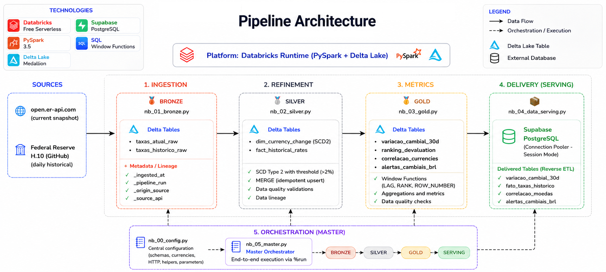

# 📈 Currency Exchange Data Pipeline


> **End-to-end** data engineering pipeline that collects real exchange rate quotes, processes them through a Medallion architecture (Bronze → Silver → Gold), and delivers analysis-ready metrics to a PostgreSQL database — all running on Databricks' free tier.

---


---

## In a nutshell

This project pulls exchange rate data from public sources, refines it through progressively higher-quality layers, and serves the result to dashboards and automations. The *subject matter* isn't groundbreaking — the value lies in **how** it was built: dimensional modeling, window functions, idempotency, secrets management, and above all, **engineering decisions to work around the constraints of a free, network-restricted environment**.

Spoiler: half the learning here came from discovering what *doesn't* work on Databricks Free and engineering around it. It's all documented below.

### What it delivers
- 📊 **11 currencies** tracked (BRL, EUR, GBP, JPY, MXN, CAD, AUD, CHF, CNY, INR, KRW) with **real data** from the Federal Reserve
- 🥇 **Business metrics**: daily variation, volatility, devaluation ranking, cross-currency correlation, and drop alerts
- 🗄️ **4 tables served** to PostgreSQL (Supabase), ready for BI
- ⚙️ **Orchestrated pipeline** — runs end-to-end with a single click

---

## Key solutions

| Challenge | Solution |
|---|---|
| Original exchange rate API (Frankfurter) **blocked by DNS** on the Free tier | Migrated to the official **Federal Reserve H.10** dataset hosted on GitHub (reachable) |
| **Historical source with no SLA** — Fed H.10/GitHub can go days without updating | Diagnostic cell comparing the latest date in the source vs. the table, isolating a "stalled pipeline" from a "stale source" |
| Need for **versioned history** of exchange rates | **SCD Type 2 with threshold** — only versions changes > 2%, preventing dimension bloat |
| Calculating **time-based variation** without workarounds | **Window functions** (`LAG`, `RANK`, `ROW_NUMBER`) over the fact table |
| **Re-runs** must not duplicate data | **Idempotent MERGE** (key-based upsert) on both the fact and dimension tables |
| Writing to Supabase **blocked** (JDBC + direct connection) | Native `postgresql` connector via **Connection Pooler (Session mode)** |
| **Credentials** kept out of the code | Password stored in **Databricks Secrets**, read at runtime |

---

## Sample Results

Queries run directly in the Supabase SQL Editor, over the most recent 30-day window:

### 📊 Volatility Ranking

```sql
SELECT moeda_codigo, volatilidade, variacao_media_diaria
FROM variacao_cambial_30d
ORDER BY volatilidade DESC;
```

| Currency | Volatility |
|---|---|
| 🇧🇷 BRL | **0.8511** (highest) |
| 🇰🇷 KRW | 0.7606 |
| 🇲🇽 MXN | 0.5407 |
| 🇦🇺 AUD | 0.5269 |
| 🇨🇭 CHF | 0.4576 |
| 🇬🇧 GBP | 0.4306 |
| 🇮🇳 INR | 0.4022 |
| 🇪🇺 EUR | 0.3594 |
| 🇨🇦 CAD | 0.2584 |
| 🇯🇵 JPY | 0.1764 |
| 🇨🇳 CNY | **0.1578** (lowest) |

**Interpretation:** BRL at the top and CNY at the bottom is exactly what theory predicts — an emerging-market floating exchange rate reacts more than one managed by the Chinese state. A good *sanity check* that the data and calculations are correct.

### 📈 Trend — Who Devalued vs. Who Appreciated

```sql
SELECT moeda_codigo, variacao_media_diaria,
    CASE WHEN variacao_media_diaria > 0 THEN 'devalued vs USD'
         WHEN variacao_media_diaria < 0 THEN 'appreciated vs USD'
         ELSE 'stable' END AS tendencia
FROM variacao_cambial_30d
ORDER BY variacao_media_diaria DESC;
```

**Interpretation:** BRL leads the devaluation (+0.126%/day on average); AUD leads the appreciation (−0.1537%/day) — and it's also one of the 4 most volatile currencies in the ranking above. This confirms that volatility measures the *magnitude* of the movement, not its *direction*.

### 🕒 Time Evolution (example: BRL)

```sql
SELECT data, ROUND(taxa_usd::numeric, 4) AS taxa
FROM fato_taxas_historico
WHERE moeda_codigo = 'BRL'
ORDER BY data;
```

**Interpretation:** the Real's daily series shows the full trajectory behind the aggregated volatility figure — useful for plotting a line chart and visualizing inflection points that the average alone doesn't reveal.

### ✅ Exchange Rate Alerts (BRL)

```sql
SELECT data, ROUND(taxa_usd::numeric, 4) AS taxa, variacao_diaria_pct
FROM alertas_cambiais_brl
ORDER BY data DESC;
```

```
Success. No rows returned
```

**Interpretation:** even as the most volatile currency in the dataset, BRL had no single day with a drop greater than 3% during the analyzed window — the volatility came from many moderate movements, not a single shock. Here, an empty table is itself a result: the alert system confirms the period was turbulent, but not catastrophic.

---

## Architecture

```
   SOURCES             INGESTION           REFINEMENT         METRICS          SERVING
┌───────────┐      ┌────────────┐    ┌─────────────┐   ┌──────────────┐  ┌────────────┐
│ open.er   │─────▶│ 🥉 BRONZE  │───▶│ 🥈 SILVER   │──▶│ 🥇 GOLD      │─▶│  Supabase  │
│ -api.com  │      │ taxas_     │    │ dim (SCD2)  │   │ variacao_30d │  │ PostgreSQL │
│ (snapshot)│      │ atual_raw  │    │ + fato      │   │ ranking      │  │            │
├───────────┤      │ taxas_     │    │ (MERGE)     │   │ alertas      │  │ (pooler,   │
│ Fed H.10  │─────▶│ historico_ │    │             │   │ correlacao   │  │  session)  │
│ (GitHub)  │      │ raw        │    │             │   │              │  │            │
└───────────┘      └────────────┘    └─────────────┘   └──────────────┘  └────────────┘
                        │                  │                  │
                        └──────── orchestration via %run (nb_05_master) ────────┘
```

**11 currencies:** BRL, EUR, GBP, JPY, MXN, CAD, AUD, CHF, CNY, INR, KRW
*(majors · Asia · commodity currencies · LatAm)*

---

| Notebook | Layer | Role |
|---|---|---|
| `nb_00_config` | — | Central configuration (schemas, currencies, HTTP, helpers) |
| `nb_01_bronze` | 🥉 | Raw ingestion from both sources + lineage metadata |
| `nb_02_silver` | 🥈 | SCD2 dimension + fact table (idempotent MERGE) |
| `nb_03_gold` | 🥇 | Metrics using window functions |
| `nb_04_data_serving` | — | Export to Supabase (+ CSV fallback) |
| `nb_05_master` | — | End-to-end orchestration |

---

## How to run

1. Import the `notebooks/` folder (`nb_00` through `nb_05`) into a Databricks workspace
2. Configure the Supabase password secret:
```bash
   databricks secrets put --scope infisical --key postgres_password --string-value "YOUR_PASSWORD"
```
3. Run `nb_05_master` — it executes the entire pipeline in sequence
4. Check the tables in the Supabase SQL Editor

> **Running locally (outside Databricks):** install the dependencies with `pip install -r requirements.txt`. Note that this covers `pyspark` and `delta-spark` for local testing — on Databricks Free these libraries already ship with the runtime, so this step is only needed if you want to run parts of the pipeline outside the platform.

> **Stack:** Databricks Free · PySpark · Delta Lake · SQL · Supabase (PostgreSQL)

---

<details>
<summary><h2> The technical story (for those who want to dig deeper)</h2></summary>

This is where the project gets genuinely interesting. The subject (exchange rates) is just the backdrop — the real learning came from **running headfirst into the limitations of Databricks Free Serverless** and engineering solutions around them. Here's the honest journey, dead ends included.

### Data source

The original plan was to use the **Frankfurter API** for exchange rate history. It didn't work. Investigating further, I found that Free Serverless egress only resolves DNS for a minimal *allowlist* — a `socket.gethostbyname()` call revealed `DNS FAIL` for virtually every exchange rate API (Frankfurter, exchangerate.host, currencyapi, fixer, openexchangerates) **and** for popular CDNs (jsdelivr, Cloudflare Pages).

I then tried the Currency-API via CDN — same block. I went to the source repository on GitHub and discovered it **doesn't commit** the JSON files (it only publishes to npm/CDN). Dead end.

What **did** work? Only two exchange-rate-related domains: `open.er-api.com` (current snapshot) and — the turning point — **GitHub** (`raw.githubusercontent.com` and `api.github.com`). That opened the door to the **official Federal Reserve H.10 dataset**, hosted on GitHub via datahub.io, which has real daily history. I migrated to it.

> **Lesson:** documenting the network limitation (with a direct DNS diagnostic in the notebook) turned into one of the project's strongest points. It demonstrates empirical investigation, not blind trial-and-error.

### Handling the Fed data

The Fed CSV has quirks that required special handling:
- It uses **country names** ("Brazil", "South Korea"), not ISO codes → required a translation map
- **EUR, GBP, and AUD** are quoted inverted (USD per currency unit) → normalized using `1/rate`
- The "30-day" window is anchored to **actual trading dates** (not calendar days), avoiding weekend/holiday gaps

Honest coverage: Fed H.10 provides 11 of the 12 currencies I originally wanted. ARS, CLP, and COP have no freely accessible daily public history — they were documented as out of scope rather than having data fabricated for them.

### Delivering to Supabase

Writing to Supabase was a sequence of obstacles, each with its own fix:

1. **`InfisicalSDKClient` to fetch the password** → `app.infisical.com` blocked by DNS. Migrated the password to **Databricks Secrets** (seeded once via the local Infisical CLI).
2. **`.format("jdbc")`** → `UNSUPPORTED_DATA_SOURCE_WRITE`. Serverless blocks generic JDBC, but accepts the native **`.format("postgresql")`** connector.
3. **`.option("sslmode", "require")`** → not supported by the native connector. Removed (SSL is automatic).
4. **Host `db.xxx.supabase.co:5432`** → `gaierror` (DNS blocked). Only the **Connection Pooler** (`aws-1-...pooler.supabase.com`) resolves.
5. **Password via `os.environ`** → `SCRAM... empty password`. Serverless ignores cluster env vars; switched to `dbutils.secrets.get()`.
6. **Pooler port 6543 (transaction mode)** → `prepared statement "S_1" already exists`. Switched to **port 5432 (session mode)** + `coalesce(1)` to serialize the write.

After all that: **4/4 tables exported successfully**.

> **Lesson:** every error introduced a new concept (allowed data sources in Serverless, connection pooling, PgBouncer/Supavisor's transaction vs. session modes). The stack trace is your friend — the solution was almost always in the first line of the `Caused by`.

### Applied engineering concepts

- **Medallion Architecture** — Bronze/Silver/Gold separation for traceability and selective reprocessing
- **Dimensional modeling** — fact table (`fato_taxas_historico`) + dimension table (`dim_moeda_cambio`)
- **SCD Type 2 with threshold** — version history, only for significant changes
- **Window functions** — `LAG` (daily variation), `RANK` (ranking), `ROW_NUMBER` (day of maximum variation)
- **Idempotency** — `MERGE`/upsert ensures re-runs don't duplicate data
- **Data quality** — `assert_not_empty` validations and domain sanity checks
- **Data lineage** — `_ingested_at`, `_pipeline_run`, `_origem_dados`, `_source_api` columns
- **Secrets management** — credentials in a vault, never in the code
- **Graceful degradation** — automatic CSV/Volume fallback if the network fails

### Scope decisions

The original challenge called for a BRL × commodities correlation via an external API — blocked by DNS. I **adapted** it into an intra-dataset correlation (each currency vs. BRL, via `F.corr`), delivering the analytical value (measuring the relationship between assets) through a viable path. A conscious, documented trade-off.

</details>

---

## Repository structure

```
.
├── assets/
│   └── architecture.png     # architecture diagram
├── notebooks/
│   ├── nb_00_config.py      # central configuration
│   ├── nb_01_bronze.py      # ingestion (snapshot + Fed history)
│   ├── nb_02_silver.py      # SCD2 + fact table
│   ├── nb_03_gold.py        # metrics (LAG, RANK, correlation)
│   ├── nb_04_data_serving.py # export → Supabase
│   └── nb_05_master.py      # orchestration
├── requirements.txt
├── LICENSE
└── README.md
```

---

## Next Steps

- [ ] Visualization **dashboard** (Metabase) connected to Supabase
- [ ] **Daily email notification** (GitHub Actions cron + Resend) reading from the data mart
- [ ] **Expand the historical window** for more robust correlations

---

## Notes

- Environment: **Databricks Free**
- Historical data: **Federal Reserve H.10** (official, public-domain source)
- This is a **portfolio** project — the focus is on sound engineering practices, not artificial complexity
