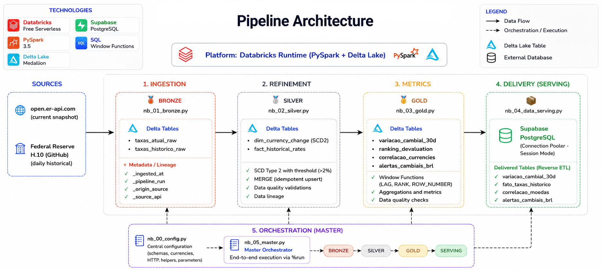

# 📈 Currency Exchange Data Pipeline


> **End-to-end** data engineering pipeline that collects real exchange rate quotes, processes them through a Medallion architecture (Bronze → Silver → Gold), and delivers analysis-ready metrics to a PostgreSQL database — all running on Databricks' free tier.

---


---

## In a nutshell

This project pulls exchange rate data from public sources, refines it through progressively higher-quality layers, and serves the result to dashboards and automations. The *subject matter* isn't groundbreaking — the value lies in **how** it was built: dimensional modeling, window functions, idempotency, secrets management, and above all, **engineering decisions to work around the constraints of a free, network-restricted environment**.

Spoiler: half the learning here came from discovering what *doesn't* work on Databricks Free and engineering around it. It's all documented below.

### What it delivers
- 📊 **11 currencies** tracked (BRL, EUR, GBP, JPY, MXN, CAD, AUD, CHF, CNY, INR, KRW) with **real data** from the Federal Reserve
- 🥇 **Business metrics**: daily variation, volatility, devaluation ranking, cross-currency correlation, and drop alerts
- 🗄️ **4 tables served** to PostgreSQL (Supabase), ready for BI
- ⚙️ **Orchestrated pipeline** — runs end-to-end with a single click

---

## Key solutions

| Challenge | Solution |
|---|---|
| Original exchange rate API (Frankfurter) **blocked by DNS** on the Free tier | Migrated to the official **Federal Reserve H.10** dataset hosted on GitHub (reachable) |
| **Historical source with no SLA** — Fed H.10/GitHub can go days without updating | Diagnostic cell comparing the latest date in the source vs. the table, isolating a "stalled pipeline" from a "stale source" |
| Need for **versioned history** of exchange rates | **SCD Type 2 with threshold** — only versions changes > 2%, preventing dimension bloat |
| Calculating **time-based variation** without workarounds | **Window functions** (`LAG`, `RANK`, `ROW_NUMBER`) over the fact table |
| **Re-runs** must not duplicate data | **Idempotent MERGE** (key-based upsert) on both the fact and dimension tables |
| Writing to Supabase **blocked** (JDBC + direct connection) | Native `postgresql` connector via **Connection Pooler (Session mode)** |
| **Credentials** kept out of the code | Password stored in **Databricks Secrets**, read at runtime |

---

## Sample Results

Queries run directly in the Supabase SQL Editor, over the most recent 30-day window:

### 📊 Volatility Ranking

```sql
SELECT moeda_codigo, volatilidade, variacao_media_diaria
FROM variacao_cambial_30d
ORDER BY volatilidade DESC;
```

| Currency | Volatility |
|---|---|
| 🇧🇷 BRL | **0.8511** (highest) |
| 🇰🇷 KRW | 0.7606 |
| 🇲🇽 MXN | 0.5407 |
| 🇦🇺 AUD | 0.5269 |
| 🇨🇭 CHF | 0.4576 |
| 🇬🇧 GBP | 0.4306 |
| 🇮🇳 INR | 0.4022 |
| 🇪🇺 EUR | 0.3594 |
| 🇨🇦 CAD | 0.2584 |
| 🇯🇵 JPY | 0.1764 |
| 🇨🇳 CNY | **0.1578** (lowest) |

**Interpretation:** BRL at the top and CNY at the bottom is exactly what theory predicts — an emerging-market floating exchange rate reacts more than one managed by the Chinese state. A good *sanity check* that the data and calculations are correct.

### 📈 Trend — Who Devalued vs. Who Appreciated

```sql
SELECT moeda_codigo, variacao_media_diaria,
    CASE WHEN variacao_media_diaria > 0 THEN 'devalued vs USD'
         WHEN variacao_media_diaria < 0 THEN 'appreciated vs USD'
         ELSE 'stable' END AS tendencia
FROM variacao_cambial_30d
ORDER BY variacao_media_diaria DESC;
```

**Interpretation:** BRL leads the devaluation (+0.126%/day on average); AUD leads the appreciation (−0.1537%/day) — and it's also one of the 4 most volatile currencies in the ranking above. This confirms that volatility measures the *magnitude* of the movement, not its *direction*.

### 🕒 Time Evolution (example: BRL)

```sql
SELECT data, ROUND(taxa_usd::numeric, 4) AS taxa
FROM fato_taxas_historico
WHERE moeda_codigo = 'BRL'
ORDER BY data;
```

**Interpretation:** the Real's daily series shows the full trajectory behind the aggregated volatility figure — useful for plotting a line chart and visualizing inflection points that the average alone doesn't reveal.

### ✅ Exchange Rate Alerts (BRL)

```sql
SELECT data, ROUND(taxa_usd::numeric, 4) AS taxa, variacao_diaria_pct
FROM alertas_cambiais_brl
ORDER BY data DESC;
```

```
Success. No rows returned
```

**Interpretation:** even as the most volatile currency in the dataset, BRL had no single day with a drop greater than 3% during the analyzed window — the volatility came from many moderate movements, not a single shock. Here, an empty table is itself a result: the alert system confirms the period was turbulent, but not catastrophic.

---

## Architecture

```
   SOURCES          INGESTION        REFINEMENT        METRICS               SERVING              CONSUMPTION
┌───────────┐    ┌────────────┐  ┌─────────────┐  ┌──────────────────┐  ┌────────────┐      ┌──────────────────┐
│ open.er   │───▶│ 🥉 BRONZE  │─▶│ 🥈 SILVER   │─▶│ 🥇 GOLD          │─▶│  Supabase  │──┬──▶│ 📊 Metabase      │
│ -api.com  │    │ raw tables │  │ dim (SCD2)  │  │ variacao_30d     │  │ PostgreSQL │  │   │   dashboards     │
├───────────┤    │            │  │ + fato      │  │ ranking          │  │ (pooler,   │  │   ├──────────────────┤
│ Fed H.10  │───▶│            │  │ + regime    │  │ vol_movel        │  │  session)  │  └──▶│ 🤖 AI agent      │
│ (GitHub)  │    │            │  │ (MERGE)     │  │ por_regime       │  │            │      │  (Streamlit:     │
└───────────┘    └────────────┘  └─────────────┘  │ alertas · correl │  └────────────┘      │  text-to-SQL+RAG)│
                      │               │           └──────────────────┘                       └──────────────────┘
                      └──── orchestration via %run (nb_05_master) ────┘
```

**11 currencies:** BRL, EUR, GBP, JPY, MXN, CAD, AUD, CHF, CNY, INR, KRW
*(majors · Asia · commodity currencies · LatAm)*

---

## The pipeline (Databricks)

| Notebook | Layer | Role |
|---|---|---|
| `nb_00_config` | — | Central config (schemas, currencies, HTTP, **history window & regimes**, helpers) |
| `nb_01_bronze` | 🥉 | Raw ingestion from both sources (**backfill / incremental** by date) + lineage |
| `nb_02_silver` | 🥈 | SCD2 dimension + fact table (idempotent MERGE) + **regime** column |
| `nb_03_gold` | 🥇 | Metrics via window functions (30d, ranking, alerts, correlation, **per-regime**, **rolling volatility**) |
| `nb_04_data_serving` | — | Export **7 tables** to Supabase (+ CSV fallback) |
| `nb_05_master` | — | End-to-end orchestration |

### History window (collection ≠ analysis)
A key design decision: the **collection** window is decoupled from the **analysis** window. `nb_00_config` exposes:
- `HIST_MODO` — `backfill` (wide, one-time) or `incremental` (short, with overlap for Fed revisions)
- `HIST_DATA_INICIO = "2015-01-01"` — ~a decade, giving a solid pre-pandemic baseline
- `REGIMES` — the pre/during/post-pandemic boundaries, stamped onto every fact row

This lets a single fact table power both **short-term** views (recent trend) and **regime comparisons** (pandemic impact) without re-collecting anything.

---

## 📊 Visualization — Metabase

Metabase runs locally via **Docker** and connects directly to the Gold layer on Supabase.

```bash
cd metabase
docker compose up -d          # Metabase at http://localhost:3000
```

The dashboard covers: the dollar's trajectory in BRL, rolling 30-day volatility (the March 2020 spike), volatility by regime, and a currency filter driving the time-series charts. Ready-to-use SQL for every card lives in [`docs/metabase-queries.md`](docs/metabase-queries.md).

> The `metabase/` folder ships only the `docker-compose.yml`; the H2 app database lives in a gitignored volume.

---

## 🤖 AI Agent — Hybrid Text-to-SQL + RAG

A natural-language interface (in Portuguese) over the same Gold layer, built as a **first hands-on experiment with agents**. The goal here was to understand how the pieces fit together — routing, tool use, guardrails, retrieval — rather than to maximize the agent's "intelligence" (the RAG context is intentionally lean).

### How it works
A lightweight **router** classifies each question and picks a path:

| Question type | Route | What happens |
|---|---|---|
| Needs a **number / calculation** | 🧮 **Text-to-SQL** | LLM generates SQL → runs on Postgres → answer + auto-plotted chart |
| Needs an **explanation / context** | 📚 **RAG** | Semantic search over project docs → grounded answer citing sources |
| Needs **both** | 🔀 **Hybrid** | Combines the computed number with documental context |

### Why not RAG for everything?
RAG *retrieves text*; it can't *compute*. For rankings, averages and volatility, **text-to-SQL** is the right tool; for "why did the dollar spike in March 2020?", **RAG** grounds the answer in curated documents (with sourced facts from the BCB / IMF). Choosing the right architecture per question type was the main takeaway — more valuable than any single framework.

### Stack (all free tiers, zero cost)
- **Streamlit** — web UI (chat + charts)
- **Groq** (Llama 3.3) — LLM for SQL generation and answers · **Ollama** for local dev (pluggable provider)
- **Gemini `text-embedding`** — embeddings for retrieval (no heavy local models)
- **NumPy** — in-memory cosine similarity (corpus is small; no vector DB needed)
- **Safety guardrails**: SELECT-only, forbidden-keyword regex, single-statement enforcement, `statement_timeout`, row `LIMIT`, and a **read-only** database user

### Run it
```bash
pip install -r requirements.txt
# set secrets: GROQ_API_KEY, GEMINI_API_KEY, SUPABASE_* (read-only user)
python app/build_index.py        # build the RAG index from app/knowledge/*.md (run once)
streamlit run app/app_chat.py    # or: python app/cli.py  (terminal version)
```

> **Honest scope:** this is a first pass at agents. It demonstrates the architecture (routing, tool use, retrieval, guardrails) end-to-end; deepening the agent's context and reasoning is a deliberate future step.

---

## How to run the pipeline

1. Import the `notebooks/` folder (`nb_00` through `nb_05`) into a Databricks workspace
2. Configure the Supabase password secret:
```bash
   databricks secrets put --scope infisical --key postgres_password --string-value "YOUR_PASSWORD"
```
3. Run `nb_05_master` — it executes the entire pipeline in sequence
4. Check the tables in the Supabase SQL Editor

> **Requirements:** `requirements.txt` covers both the app (Streamlit, psycopg2, plotly, groq, google-genai, numpy) and the pipeline (`pyspark`, `delta-spark`) for optional local runs. On Databricks Free the Spark libraries already ship with the runtime.

> **Stack:** Databricks Free · PySpark · Delta Lake · SQL · Supabase (PostgreSQL) · Docker · Metabase · Streamlit · Groq · Gemini embeddings

---

<details>
<summary><h2> The technical story (for those who want to dig deeper)</h2></summary>

This is where the project gets genuinely interesting. The subject (exchange rates) is just the backdrop — the real learning came from **running headfirst into the limitations of free tiers** and engineering solutions around them. Here's the honest journey, dead ends included.

### Data source

The original plan was the **Frankfurter API**. It didn't work. Free Serverless egress only resolves DNS for a minimal *allowlist* — a `socket.gethostbyname()` call revealed `DNS FAIL` for virtually every exchange-rate API (Frankfurter, exchangerate.host, currencyapi, fixer, openexchangerates) **and** for popular CDNs (jsdelivr, Cloudflare Pages).

What **did** work? Only `open.er-api.com` (current snapshot) and — the turning point — **GitHub** (`raw.githubusercontent.com`). That opened the door to the **official Federal Reserve H.10 dataset**, hosted on GitHub via datahub.io, with real daily history. I migrated to it.

> **Lesson:** documenting the network limitation (with a direct DNS diagnostic in the notebook) became one of the project's strongest points — empirical investigation, not blind trial-and-error.

### Handling the Fed data

- Uses **country names** ("Brazil", "South Korea"), not ISO codes → translation map
- **EUR, GBP, AUD** are quoted inverted (USD per unit) → normalized with `1/rate`
- The window is anchored to **actual trading dates**, avoiding weekend/holiday gaps

Honest coverage: Fed H.10 provides 11 of the 12 currencies originally wanted. ARS, CLP and COP have no freely accessible daily history — documented as out of scope rather than fabricated.

### Expanding the history (30 days → ~a decade)

The original project kept only the last 30 days. The insight while extending it: **the collection window should be decoupled from the analysis window.** The Fed CSV already contains decades of history — the old code was discarding it in `datas_disp[-dias:]`. Pulling from 2015 costs virtually nothing extra (it's the same download), so I switched Bronze to accept a **date-based backfill** and stamped each fact row with its **regime**. Result: ~30k rows enabling both short-term views and pre/during/post-pandemic comparisons — from one fact table.

### Delivering to Supabase

Writing to Supabase was a sequence of obstacles, each with its own fix:

1. **Infisical SDK** to fetch the password → `app.infisical.com` blocked. Migrated to **Databricks Secrets**.
2. **`.format("jdbc")`** → `UNSUPPORTED_DATA_SOURCE_WRITE`. Serverless accepts the native **`.format("postgresql")`** connector.
3. **`sslmode=require`** → unsupported by the native connector. Removed (SSL is automatic).
4. **Host `db.xxx.supabase.co`** → `gaierror` (DNS blocked). Only the **Connection Pooler** resolves.
5. **Password via `os.environ`** → empty password. Serverless ignores cluster env vars; used `dbutils.secrets.get()`.
6. **Pooler port 6543 (transaction mode)** → `prepared statement already exists`. Switched to **port 5432 (session mode)** + `coalesce(1)`.

After all that: all tables exported successfully.

> **Lesson:** every error introduced a new concept (allowed data sources in Serverless, connection pooling, PgBouncer/Supavisor's transaction vs. session modes). The stack trace is your friend.

### Hosting the AI agent for free

The agent uses **Ollama** locally, but a local LLM can't be hosted 24/7 on a free tier (RAM/GPU). So the LLM provider is **pluggable**: `LLM_PROVIDER=ollama` for dev, `LLM_PROVIDER=groq` for the deployed app — same code. For RAG, the usual `sentence-transformers` pulls in PyTorch (~2 GB) and blows past Streamlit Cloud's memory, so embeddings run **via the Gemini API** and similarity is a plain NumPy cosine — no heavy dependencies. And to connect on the pooler, the username needs the `.project_ref` suffix (`ENOIDENTIFIER` / `ENOTFOUND` errors otherwise).

> **Lesson:** "free" often forces better architecture — dependency inversion (pluggable LLM), and choosing the lightest tool that does the job.

### Applied engineering concepts

- **Medallion Architecture** — Bronze/Silver/Gold separation for traceability and selective reprocessing
- **Dimensional modeling** — fact (`fato_taxas_historico`) + dimension (`dim_moeda_cambio`) + regime attribute
- **SCD Type 2 with threshold** — versioned history, only for significant changes
- **Window functions** — `LAG`, `RANK`, `ROW_NUMBER`, and rolling `STDDEV` for moving volatility
- **Idempotency** — `MERGE`/upsert so re-runs don't duplicate
- **Data quality & lineage** — `assert_not_empty`, sanity checks, `_ingested_at`/`_pipeline_run`/`_origem_dados`
- **Secrets management** — credentials in a vault, never in code; **read-only** DB user for public consumers
- **Data-product thinking** — one Gold layer, two consumers (dashboards + agent)
- **Agentic patterns** — ReAct loop, tool use, intent routing, RAG retrieval, defense-in-depth guardrails

### Scope decisions

The original challenge called for a BRL × commodities correlation via an external API — blocked by DNS. I **adapted** it into an intra-dataset correlation (each currency vs. BRL, via `F.corr`), later extended **per regime**. A conscious, documented trade-off.

</details>

---

## Repository structure

```
.
├── app/                       # 🤖 AI agent (Streamlit)
│   ├── agent.py               #   text-to-SQL core (LLM, guardrails, ReAct loop)
│   ├── rag.py                 #   semantic retrieval (Gemini embeddings + NumPy)
│   ├── hibrido.py             #   router + orchestration (SQL / RAG / hybrid)
│   ├── app_chat.py            #   web UI (chat + auto charts)
│   ├── build_index.py         #   builds the RAG index from knowledge/*.md
│   ├── cli.py                 #   terminal version
│   └── knowledge/             #   RAG corpus (glossary, macro context) + index
├── metabase/
│   └── docker-compose.yml     # 📊 Metabase (dashboards over Supabase)
├── docs/
│   └── metabase-queries.md    #   ready-to-use SQL for each dashboard card
├── notebooks/                 # 🏗️ Databricks pipeline
│   ├── nb_00_config.py        #   central config (+ history window & regimes)
│   ├── nb_01_bronze.py        #   ingestion (snapshot + Fed backfill/incremental)
│   ├── nb_02_silver.py        #   SCD2 + fact table + regime
│   ├── nb_03_gold.py          #   metrics (LAG, RANK, rolling vol, per-regime)
│   ├── nb_04_data_serving.py  #   export → Supabase (7 tables)
│   └── nb_05_master.py        #   orchestration
├── assets/                    # architecture & pipeline diagrams
├── requirements.txt
├── LICENSE
└── README.md
```

---

## Roadmap

- [x] **Historical window expanded** (30 days → 2015+) with pre/during/post-pandemic regimes
- [x] **Visualization dashboard** (Metabase) connected to Supabase
- [x] **Natural-language AI agent** (hybrid text-to-SQL + RAG) over the data mart
- [ ] Deepen the agent's context & reasoning (richer corpus, conversational memory)
- [ ] **Daily email notification** (GitHub Actions cron + Resend) reading from the data mart
- [ ] Persistent 24/7 hosting for the dashboards and agent

---

## Notes

- Environments: **Databricks Free** (pipeline) · **Docker** (Metabase) · **Streamlit Community Cloud** (agent)
- Historical data: **Federal Reserve H.10** (official, public-domain source)
- This is a **portfolio** project — the focus is on sound engineering practices, not artificial complexity
